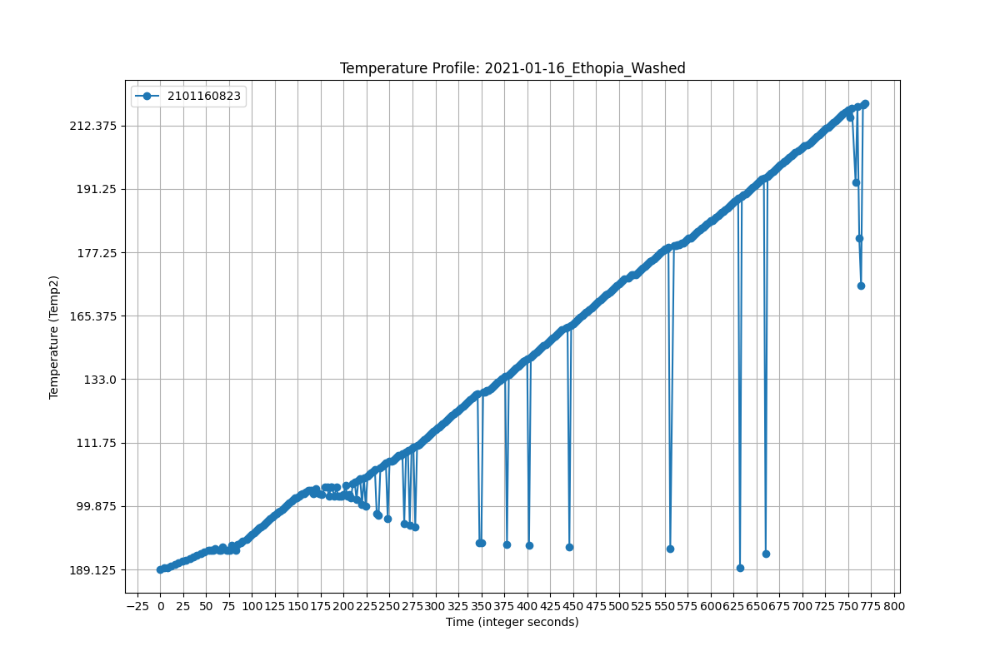

# Coffee Data Management Project

This repository contains Python code and resources for managing and analyzing coffee roasting data.

## Overview
This project was designed to address real-world challenges in coffee roasting business by creating a data collection and analysis system. The goal was to collect roasting data, enabling analysis to improve operations and drive business decisions.

This system features a MySQL database deployed on a cloud platform with remote access, enabling efficient data storage and retrieval. Python scripts handle data input, cleaning, and analysis, ensuring data accuracy and actionable insights. 

This experience demonstrated the power of data-driven solutions to address real-world challenges.

##  Project Architecture
For detailed architecture regarding this project: `architecture_diagram/architecture_diagram.md`

## Data Overview
This project processes two types of datasets with distinct formats:
1. **New Data**: CSV files with unified naming conventions, easily integrated into the database.
2. **Old Data**: Log files with inconsistent formats, requiring customized processing.
For detailed explanation and comparison: `sample_data/README.md`

## Analysis
Using data from the past three years, I performed a preliminary analysis to explore customer preferences. Key findings include:
- **Roasting Profile Curve**:

  
- **Bean Type Preference**:

  
- **Process Type Preference**:

  

For detailed methods and visualizations, see `Jupyter_Notebooks/README.md`.

## Potential Directions
- Incorporating detailed drop time data and sales metrics into the analysis framework.
- Investigating the feasibility of predictive models to enhance roasting optimization.

## Getting Started 
1. Clone this repository: `git clone <repository-url>`
2. Install dependencies: `pip install -r requirements.txt`
3. See `User Manual.md` for detailed setup and usage instructions.

For detailed data management workflows, see `src/README.md`.

## Test
- Run tests for new data: `python test/new_data/test_new_data_management.py`
- Run tests for old data: `python test/old_data/test_old_data_management.py`

For detailed testing workflows, see `test/README.md`.

## Potential Directions
- Adding detailed data on bean origin, roasting level, drop times, and crack times to enhance analysis.
- Integrating sales data for a more comprehensive understanding of roasting impacts.
- Exploring predictive models to optimize roasting processes.

## Security Disclaimer
Sensitive information in this project (e.g., database credentials) is for demonstration only. 

For detailed information, see `Support.md`.
