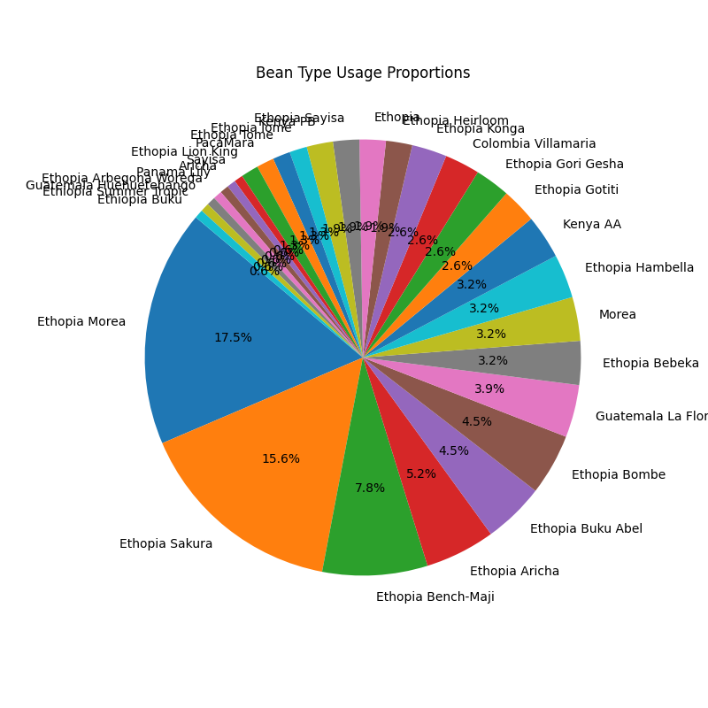
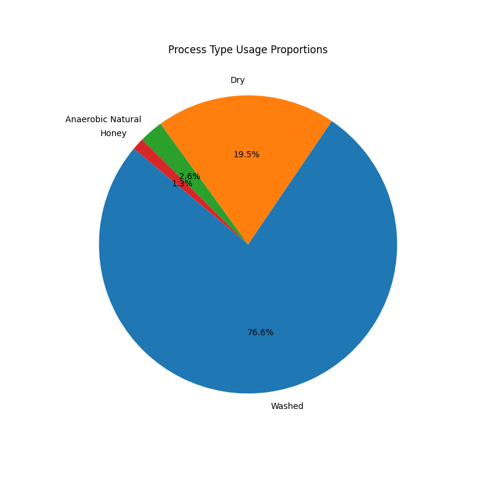

# Coffee Data Management Project

This repository contains Python code and resources for managing and analyzing coffee roasting data.

## Features
- Organizes historical data in a structured MySQL database.
- Collects real-time roasting temperature data, and sythesize it to MySQL database. 
- Provides analysis tools for visualizing temperature trends.

##  Architecture
- For detailed architecture regarding this project: `architecture_diagram/architecture_diagram.md`

# Data Overview
This project processes two types of datasets, distinguished by their data format. The data format was updated this year, resulting in differences in the processing methods. Both sample data is provided for demonstration, please refer to: `sample_data` file.

### Data Format
1. New Data: 
 - Key Characteristics:
   - In csv format.
   - Naming: Unified in file naming. 
     YY-MM-DD_TTTT_beantype_processtype.csv
 - Processing Workflow:
   - Please refer to `src/new_data_management/app_new_data_management.py`
2. Old Data: 
 - Key Characteristics:
   - In log format.
   - Naming: Not unified in file naming. 
     YY-MM-DD_TTTT_descirption.csv
 - Processing Workflow:
   - Please refer to 'src/old_data_management/app_old_data_management.py'

### Explanation of Key Differences
- Format: New data are stored in csv format, where as old data are stored in log.
- Naming: New data has unified naming rules, where as old data has different descriptions.

### How Data is Handled
- New Data: 
- Old Data: 

# Data Management
### How to Collect Data
1. Clone this repository.
2. Install dependencies: `pip install -r requirements.txt`
3. Run main application: 
   - organize new data: `src/new_data_management/app_new_data_management.py`
   - organize old data: `src/old_data_management/app_old_data_management.py`

### New Data Management Scripts Overview
- **app_new_data_management.py**: Processes CSV files containing coffee roasting data by extracting timestamp, temp1, and temp2 columns dynamically. Parses bean_type and process_type from file names (e.g., YY-MM-DD-TTTT_beantype_processtype.alog) and integrates the information before uploading it to a MySQL database, ensuring compatibility with existing database schema.

### Old Data Management Scripts Overview
- **linebreak_logdata_1.py**: Breaks the log data into lines for easier processing.
    - **extract_lists_1.1**: Extracts relevant data from the log and stores it in temporary files.
    - **file_modification_1.2.py**: Modifies the content of the temporary files for better organization.
    - **timestamps_1.3.py**: Converts timestamp data into a format usable by SQL.
- **integrate_lists_2.py**: Integrates the extracted lists into a table format.
- **import_sql_3.py**: Imports the table data into personal SQL database.
- **delete_temporary_files_4.py**: Deletes temporary files after processing is complete.

# Test

### How to Run Test
1. Run the testing application:
   - test new data: `test/new_data/test_new_data_management.py`
   - test old data: `test/old_data/test_old_data_management.py`


### GitHub Actions Workflow
To automate and validate the test process, I have configured GitHub Actions workflow. 
   - for new data: `.github/workflows/python-test_new_data_management.yml`
   - for old data: `.github/workflows/python-test_old_data_management.yml`

### Test Script Overview
- **test_main.py**: Validates the correctness of data extraction and transformation logic., and verifies that data is successfully imported into the MySQL database.
- **python-app_new_data_management.yml**: Automates the testing process by setting up the Python environment, installing dependencies, and running tests on every push or pull request. It ensures that the testing_new_data.py script functions correctly and verifies the integration with MySQL by running tests as part of the CI pipeline.

### Differences Between Test and Production Scripts
To facilitate testing without requiring access to the actual NAS system or MySQL database, the test scripts include the following modifications:
1. NAS System Simulation:
- Instead of connecting to a real NAS, test scripts use mock functions to simulate data retrieval.
- Mocked paths and sample data are used to represent files stored on the NAS.
2. MySQL Database Simulation:
- Test scripts do not connect to a real database but use simulated connections.
- Data upload functions print outputs to verify the process instead of executing actual database queries.

# Analysis
In this analysis, I utilized data collected over the past three years to gain insights into bean and process type preferences. The data was processed and cleaned using Jupyter Notebook to ensure its accuracy and completeness. 
Using visualization tools like **Matplotlib**, I was able to explore trends and patterns within the dataset. The following are two key visualizations that illustrate the preferences for different bean types and process types:

### Bean Type Preference
This chart represents the distribution of different bean types used in roasting. It provides insights into which bean varieties are most popular and allows for a better understanding of customer preferences.


### Process Type Preference
This chart displays the preference for different roasting processes. It helps to visualize which roasting methods are most frequently chosen, providing useful information for optimizing production strategies.


These visualizations are the result of a preliminary analysis performed in Jupyter Notebook, and they serve as an initial exploration of the data. The goal was to identify patterns that could inform future decisions and guide more in-depth analyses.

## Security Disclaimer
The sensitive information (e.g., usernames and passwords) in this project is for demonstration purposes only. It is included to showcase how the project functions. 

For production environments, please follow these best practices:
1. Store sensitive information using environment variables.
2. Ensure that `.env` files or other configuration files are not committed to version control (e.g., by adding them to `.gitignore`).
3. Regularly update passwords and use strong passwords.

### Configuring Environment Variables
You can store sensitive information in a `.env` file and then use Python’s `os.getenv` method to retrieve it. For example:
```python
import os

DB_PASSWORD = os.getenv("DB_PASSWORD")


